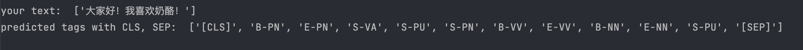
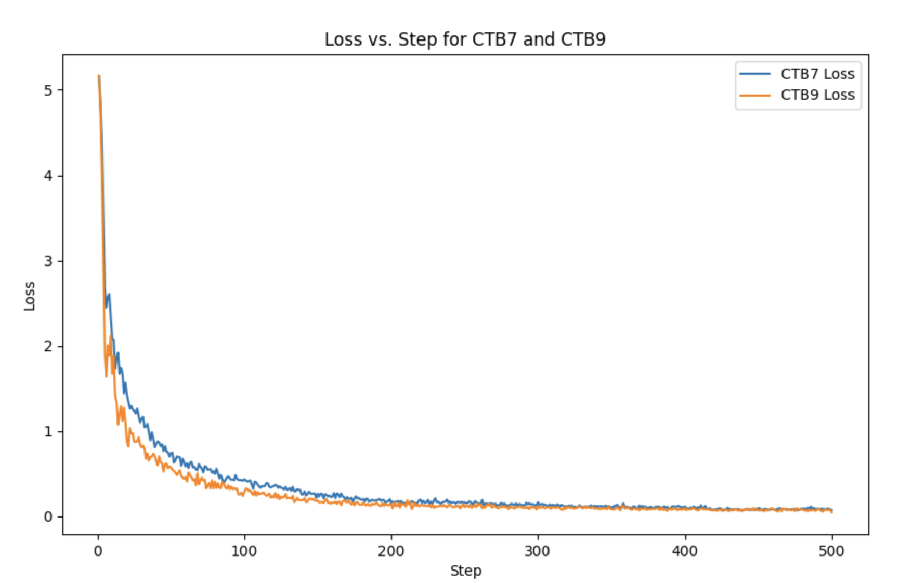
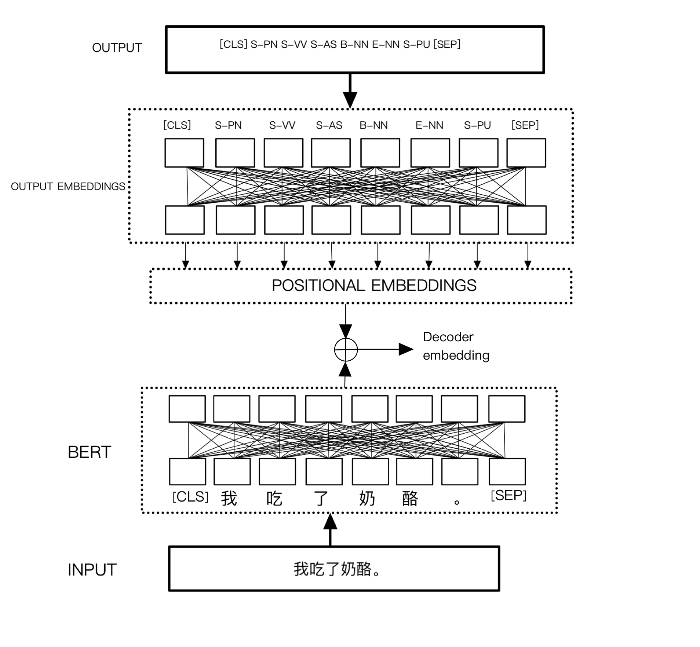

# Joint Chinese Word Segmentation and Part-of-Speech Tagging with the Transformer
This is the code accompanying my research project paper on Joint Chinese Word Segmentation and Part-of-Speech Tagging with the Transformer.
First, check out requirements.txt

This will allow you to write any sentence and see how the model works.

To train, you need to obtain the data yourself first from the Penn Chinese Treebank (CTB7, CTB9).

Once you obtain the data, you can run. This will preprocess all the data, you will be prompted to 
select a version to train. 
```shell
$ chmod 700 run_train.sh     
$ ./run_train.sh   
```
To evaluate the model, you can run (but you may have to manually change the code **for now**, if you want to evaluate different versions)
```shell
$ python3 evaluate.py
```
### Example run
If you just want to check out the model, I can share a trained version of CTB9, then you can run
```shell
$ python3 priv_test.py
```
It looks something like this:

### Training loss for the first 500 steps

### Embeddings for the Decoder
